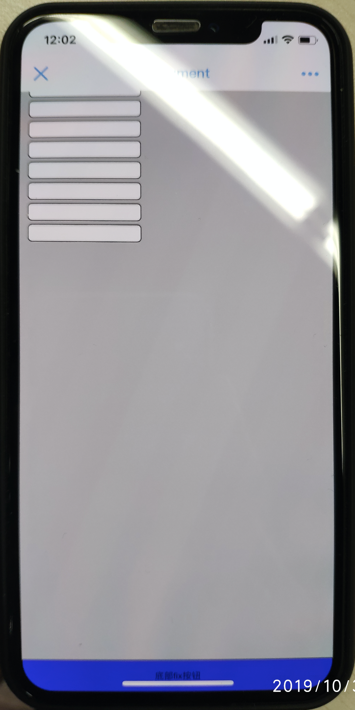

## compatibility
#### ios12版本 fix固底按钮，键盘弹出收起后，无法点击，复现代码如下
```html
<!-- 此处有多个重复的 input 元素 -->
<div>
    <input type="text" />
</div>
<button onclick="alert(1)">底部fix按钮</button>
```
```css
body {
  background-color: #ccc;
}
input {
  border: 1px solid #000;
}
button {
  width: 100%;
  height: 40px;
  text-align: center;
  position: fixed;
  left: 0;
  right: 0;
  bottom: 0;
  background-color: blue;
}
```
如下图所示，图二中底部按钮无法点击


原因是因为键盘弹起后，将页面顶起，而收起后页面没有完全归位，实际是靠上一点。所以解决办法为输入框失焦的时候，将页面滑动回顶部
```js
(() => {
    let userAgent = navigator.userAgent;
    let version = userAgent.match(/cpu iphone os (.*?) like mac os/i);
    let verName = version ? version[1].replace('_', '.') : 0;
    if (parseFloat(verName) > 12) {
        let isResetPage = false;
        document.body.addEventListener('focusin', () => {
            console.log('focusin')
            isResetPage = false;
        });
        document.body.addEventListener('focusout', () => {
            isResetPage = true;
            console.log('focusout')
            setTimeout(() => {
                if (isResetPage) {
                    window.scroll({
                        top: 0,
                        left: 0,
                        behavior: "smooth"
                    });
                }
            }, 0);
        });
    }
})();
```