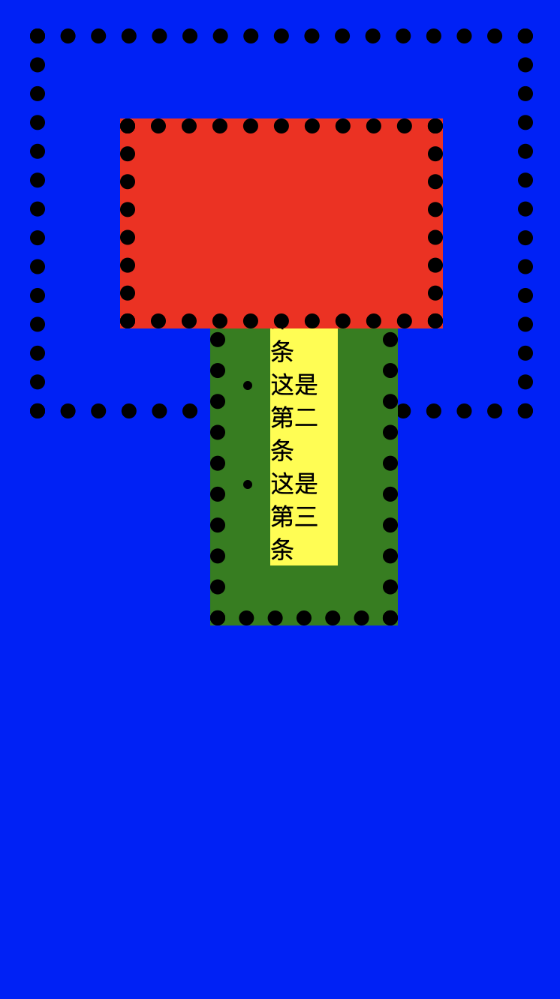
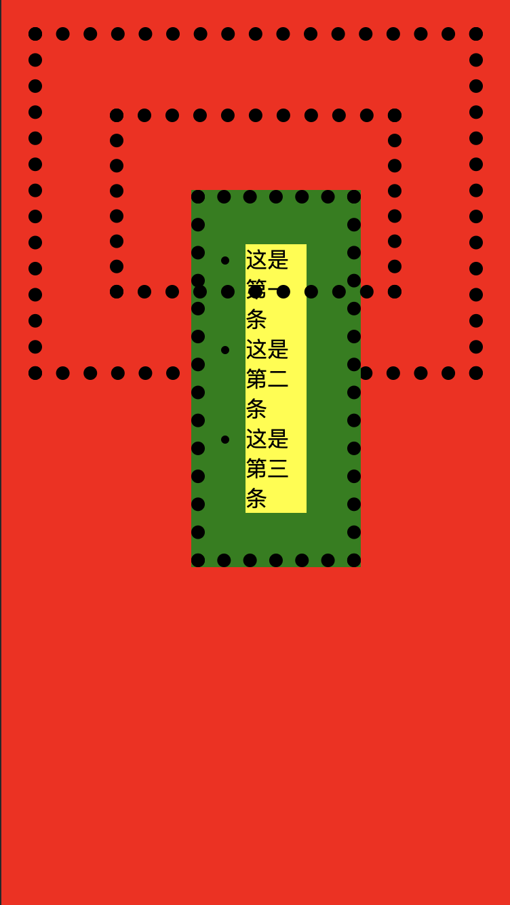

## css
#### html 和 body 在 css 中的区别
- 参考文献:[张鑫旭对html与body的一些研究与理解](https://www.zhangxinxu.com/wordpress/2009/09/%e5%af%b9html%e4%b8%8ebody%e7%9a%84%e4%b8%80%e4%ba%9b%e7%a0%94%e7%a9%b6%e4%b8%8e%e7%90%86%e8%a7%a3/)
1. 遇到的问题:
    1. 设置了 html 的背景色 a, body 背景色 b, body 中 ul 元素绝对定位, z-index 设置为 -1, 此时 ul 被 b 颜色盖住
    2. 删除 html 标签的 a, 则 body 中的背景色不会覆盖 ul 元素
    3. 具体看代码:

##### html 有背景色情况代码及图片
```html
<ul>
    <li>这是第一条</li>
    <li>这是第二条</li>
    <li>这是第三条</li>
</ul>
```
```css
html {
  background-color: blue;
  margin: 20px;
  padding: 30px;
  border: 10px dotted #000;
}

body {
  margin: 20px;
  padding: 30px;
  height: 60px;
  border: 10px dotted #000;

  background-color: red;

  position: relative;
}

ul {
  margin: 20px;
  padding: 30px;
  border: 10px dotted #000;

  background-color: green;
  position: absolute;
  z-index: -1;
}

li {
  background-color: yellow;
}
```

##### html 无背景色情况代码及图片
```css
html {
  margin: 20px;
  padding: 30px;
  border: 10px dotted #000;
}

body {
  margin: 20px;
  padding: 30px;
  height: 60px;
  border: 10px dotted #000;

  background-color: red;

  position: relative;
}

ul {
  margin: 20px;
  padding: 30px;
  border: 10px dotted #000;

  background-color: green;
  position: absolute;
  z-index: -1;
}

li {
  background-color: yellow;
}
```


2. 问题分析(根据张大神的文章并加上了自我理解, 不确定对不对)

从实际情况展示来看, 元素设置 margin 值, 背景色只在边框内部展示, 但是实际为整个页面都变了颜色, 推断浏览器容纳网页的容器, 暂时称为 c, c 的 css 层级是最低的. 会将 html 标签的背景色"抢"成自己的背景色, 如果 html 标签没有设置背景色, 则会去"抢" body 标签的背景色. 而被抢背景色的标签会自身失去背景色. 这样的话, 可以解释, 为什么有背景色的 body 在 html 背景色未设置的时候, 不会覆盖 `z-index < 0` 元素, 而在 html 设置了背景色的时候, 会覆盖了 `z-index < 0` 的元素.

